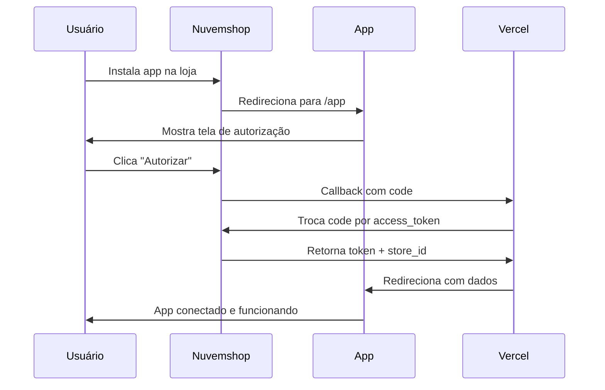

# 🏆 LatAm Treasure Bridge v2.0

> **Aplicativo Standalone para Nuvemshop** - Integração completa com sistemas ERP

## 📋 Sobre o Projeto

O **LatAm Treasure Bridge** é um aplicativo standalone para Nuvemshop que permite a integração completa entre sua loja e sistemas ERP. Desenvolvido seguindo as melhores práticas da [documentação oficial da Nuvemshop](https://dev.nuvemshop.com.br/docs/applications/standalone).

### 🎯 Funcionalidades Principais

- ✅ **Aplicativo Standalone**: Funciona como aplicação externa à Nuvemshop
- ✅ **OAuth Seguro**: Implementação completa do fluxo de autenticação
- ✅ **Sincronização ERP**: Importa produtos do ERP para a Nuvemshop
- ✅ **Interface Moderna**: Design responsivo e intuitivo
- ✅ **Histórico Completo**: Acompanhe todas as sincronizações realizadas
- ✅ **Deploy Otimizado**: Configurado para Vercel com performance máxima

## 🏗️ Arquitetura

```
projetosopracallback/
├── api/                    # Serverless Functions (Vercel)
│   ├── app.js             # Entry point do aplicativo (/app)
│   ├── callback.js        # OAuth callback handler
│   ├── erp-config.js      # Configuração do ERP
│   ├── sync-products.js   # Sincronização de produtos
│   └── webhooks/          # Webhooks da Nuvemshop
├── client/                # React App (Frontend)
│   ├── src/
│   │   ├── App.tsx        # Aplicação principal
│   │   ├── App.css        # Estilos modernos
│   │   └── index.tsx      # Entry point React
│   └── build/             # Build de produção
├── vercel.json            # Configuração do Vercel
└── package.json           # Dependências principais
```

## 🚀 URLs do Aplicativo

### Produção (Vercel)
- **Aplicativo**: `https://projetosopracallback.vercel.app/app`
- **Callback OAuth**: `https://projetosopracallback.vercel.app/api/callback`

### Configuração na Nuvemshop
```
App ID: 19190
Site do aplicativo: https://projetosopracallback.vercel.app/app
URL de redirecionamento: https://projetosopracallback.vercel.app/api/callback
Incorporar ao administrador: ❌ (DESMARCADO - Standalone)
```

## 📱 Como Funciona

### 1. **Instalação do App**
1. Lojista acessa a App Store da Nuvemshop
2. Clica em "Instalar" no LatAm Treasure Bridge
3. É redirecionado para autorização OAuth
4. Após autorizar, retorna ao aplicativo já autenticado

### 2. **Configuração do ERP**
1. Acessa a aba "Configuração"
2. Insere URL do ERP (ex: `https://meu-erp.com`)
3. Insere Token de autenticação
4. Salva e testa a conexão

### 3. **Sincronização**
1. Acessa a aba "Sincronização"
2. Clica em "Iniciar Sincronização"
3. Produtos são importados do ERP para Nuvemshop
4. Progresso é exibido na aba "Status"

## 🛠️ Desenvolvimento Local

### Pré-requisitos
- Node.js 18+
- NPM ou Yarn
- Conta na Vercel (para deploy)

### Instalação
```bash
# Clone o repositório
git clone <url-do-repo>
cd projetosopracallback

# Instalar dependências da API
npm install

# Instalar dependências do cliente
cd client
npm install --legacy-peer-deps
cd ..
```

### Desenvolvimento
```bash
# Rodar em modo desenvolvimento
npm run dev

# Ou usar Vercel CLI
vercel dev
```

### Build e Deploy
```bash
# Build do cliente
npm run build

# Deploy para Vercel
vercel --prod
```

## 🔧 Configuração de Ambiente

### Variáveis no Vercel
```bash
# Configurar na dashboard do Vercel
APP_ID=19190
CLIENT_SECRET=a2fd713e74bf1d526c7e0514774cbee5f390a8302c9195b0
```

### Configuração local (.env)
```bash
# Para desenvolvimento local
VERCEL_ENV=development
APP_ID=19190
CLIENT_SECRET=a2fd713e74bf1d526c7e0514774cbee5f390a8302c9195b0
```

## 📡 Endpoints da API

### `/api/app` (GET)
- **Função**: Serve o aplicativo React
- **Tipo**: Serverless Function
- **Resposta**: HTML da aplicação

### `/api/callback` (GET)
- **Função**: Processa OAuth callback
- **Parâmetros**: `code`, `state`
- **Resposta**: Página de sucesso + redirecionamento

### `/api/erp-config` (GET/POST)
- **Função**: Gerencia configuração do ERP
- **GET**: Retorna configuração atual
- **POST**: Salva nova configuração

### `/api/sync-products` (GET/POST)
- **Função**: Sincronização de produtos
- **GET**: Histórico de sincronizações
- **POST**: Inicia nova sincronização

## 🔄 Fluxo OAuth Detalhado



## 🎨 Interface do Usuário

### Tela de Instalação
- Design moderno com gradientes
- Instruções claras
- Botão de instalação destacado

### Aplicativo Principal
- **Header**: Status da conexão e badges
- **Navegação**: Tabs para Configuração, Sincronização e Status
- **Configuração**: Formulário para dados do ERP
- **Sincronização**: Interface para importar produtos
- **Status**: Histórico detalhado das operações

## 🔒 Segurança

- ✅ **OAuth 2.0**: Fluxo padrão da Nuvemshop
- ✅ **CORS**: Configurado corretamente
- ✅ **Headers**: X-Frame-Options para segurança
- ✅ **Validação**: Inputs sanitizados e validados
- ✅ **Tokens**: Armazenamento seguro (localStorage)

## 📊 Monitoramento

### Logs no Vercel
- Todas as operações são logadas
- Erros detalhados para debug
- Timestamps para rastreamento

### Feedback Visual
- Alertas coloridos para status
- Loading states em todas as operações
- Confirmações de sucesso/erro

## 🚨 Troubleshooting

### Problema: App não carrega
- **Causa**: Erro na build ou configuração Vercel
- **Solução**: Verificar logs no Vercel Dashboard

### Problema: OAuth não funciona
- **Causa**: URLs incorretas ou Client Secret inválido
- **Solução**: Verificar configuração no painel Nuvemshop

### Problema: Sincronização falha
- **Causa**: ERP inacessível ou token inválido
- **Solução**: Testar conexão ERP manualmente

## 📝 Próximas Funcionalidades

- [ ] Sincronização bidirecional (Nuvemshop → ERP)
- [ ] Webhooks para atualizações em tempo real
- [ ] Dashboard com métricas de vendas
- [ ] Suporte a múltiplos ERPs
- [ ] Backup automático de produtos
- [ ] API para integrações customizadas

## 🤝 Contribuição

1. Fork o projeto
2. Crie uma branch: `git checkout -b feature/nova-funcionalidade`
3. Commit: `git commit -m 'Adiciona nova funcionalidade'`
4. Push: `git push origin feature/nova-funcionalidade`
5. Abra um Pull Request

## 📄 Licença

Este projeto está sob a licença MIT. Veja o arquivo [LICENSE](LICENSE) para detalhes.

## 📞 Suporte

- **Documentação**: [Nuvemshop Developers](https://dev.nuvemshop.com.br)
- **Issues**: Use as Issues do GitHub
- **Email**: contato@latamtreasure.com

---

**Desenvolvido com ❤️ para a comunidade Nuvemshop**

🏆 **LatAm Treasure Bridge** - Conectando seu ERP com o futuro do e-commerce
